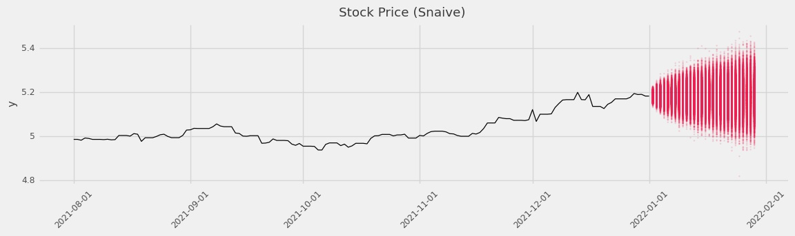

[](https://github.com/alexhallam/tablespoon/actions/workflows/python-app.yml)

<h1 align="center">tablespoon</h1>
<p align="center"><b>T</b>ime-series <b>B</b>enchmark methods that are <b>S</b>imple and <b>P</b>robabilistic</p>

<p align="center"></p>


# Documentation and quick links
* [Introduction](#introduction)
* [Quick Example](#quick-example)
* [Why Run Simple Methods](#why-run-simple-methods)
* [Goals of this package](#goals-of-this-package)
* [Non-Goals](#non-goals)
* [Forecast Method Documentation](docs/FORECAST_METHODS.md)
* [Installation](#installation)
* [Recommended probabilistic forecasting packages](#recommended-probabilistic-forecasting-packages)
* [Learn more about forecasting](#learn-more-about-forecasting)

# Introduction

Many methods exist for probabilistic forecasting. If you are looking for an
impressive probabilistic forecasting package see the list of recommendation at
the bottom of this README. This package is <b>exceptionally ordinary</b>. It is
expected that this package may be used as a compliment to what is already out
there.

# Why Run Simple Methods

We have found, by experience, many good uses for the methods in this package.
To often we see that forecast methods go in production without a naive method to
accompany it. This is a missed opportunity.

1. **Naive May Be Good Enough**: Some applications do not need anything more
   impressive than a simple forecasting method.
2. **Get A Denominator for Relative Metrics**: Though naive methods can usually
   be beat it is good to know the relative improvement over the benchmark. This
   can allow a forecasting team to market their alternative forecast when the
   'skill score' is impressive.
3. **Easy to productionize and get expectations**: Get a sense for how good is
   good enough. In many applications a forecast team is asked to forecast, but
   stakeholders provide no line-in-the-sand for when the forecasting work needs
   to stop. One reasonable approach is to run the benchmarks found in this
   package in beat the best performing benchmark by a margin that is
   statistically significant.
4. **Resilience in Production - Why not have many models?**: Sometimes, despite
   out best efforts our production model does something unexpected. In this
   case it is nice to have a simple backup that is cheap to generate and good
   enough to fall back on. In this way a production forecast pipeline gains
   strength from a diversity of models.
5. **Easy Uncertainty Quantification**: More and more we see that application
   are not about forecast accuracy, but instead about forecasting uncertainty.
   Capturing the full distribution helps firms set "service levels" aka
   percentiles of the distribution for which they are prepared to serve. Even
   if you have the worlds most accurate unbiased forecast the median point is
   an underforecast half the time. For this reason it is best to provide a
   distribution of simulated future values and the firm may decide for
   themselves what risks they are or are not willing to take.

# Quick Example

We show a quick example below. 

For more examples see [Simple Example](https://alexhallam.github.io/tablespoon/section/plotting/), [Extended Example](https://alexhallam.github.io/tablespoon/section/extended/)

### Seasonal Example: No Stan Backend

In this example I am using fake seasonal data. I also turn off the Stan backend. This 
comes at the lose of having the No U-Turn sampler, but removes the need to compile the model.
Since this package is a collection of simple methods it does make sense to allow this option.

```python
```python
import tablespoon as tbsp
from tablespoon.data import SEAS

sn = tbsp.Snaive()
df_sn = sn.predict(
    SEAS, horizon=7 * 4, frequency="D", lag=7, uncertainty_samples=8000, use_stan_backend=False
).assign(model="snaive")

print(df_sn.head(10))
```

### Stock Prediction

```python
import tablespoon as tbsp
from tablespoon.data import APPL

# Uncomment if this is your first time installing cmdstanpy
# from cmdstanpy import install_cmdstan
# install_cmdstan()

n = tbsp.Naive()
df_n = n.predict(
    APPL, horizon=7 * 4, frequency="D", lag=1, uncertainty_samples=8000
).assign(model="naive")

print(df_n.head(10))
```

```sh
          ds  rep    y_sim  model
0 2022-01-02    0  5.20006  naive
1 2022-01-02    1  5.16789  naive
2 2022-01-02    2  5.17641  naive
3 2022-01-02    3  5.19340  naive
4 2022-01-02    4  5.20075  naive
5 2022-01-02    5  5.17681  naive
6 2022-01-02    6  5.20302  naive
7 2022-01-02    7  5.18896  naive
8 2022-01-02    8  5.19622  naive
9 2022-01-02    9  5.17469  naive
```
<p align="center"></p>


# Goals of this package

1. ♙**Simple**: Not just in the forecasts themselves, but also from the
   users perspective.
2. ♝**Documented**: It should be very clear exactly how forecasts are getting
   generated. We document the parameterization of the models to make this as
   obvious and uninteresting as possible. See [Forecast Method Math Documentation](https://alexhallam.github.io/tablespoon/section/math/)
3. ♜**Stable**: We want this package to feel rock solid. For this to happen
   we keep the feature set relatively small. We believe that after the initial 
   development of this package we should spend out time maintaining the code as
   oppose to thinking of new features.
4. ♞**Distributional**: Quantification of uncertainty is the name of
   the game. Because this uses [Stan](https://mc-stan.org/) in the backend users get access to state of
   of the art numerical sampling.

# Non-Goals

1. 🔥**Circut Melting Focus on Speed**: Not to say this is a slow package. In fact, all
   models do get compiled. It is very fast! We just don't put any extra effort to make 
   it faster than the `C++` Stan compiled model.
2. 🤖**New/Complex Forecast Models**: Again, this is out of scope. If you are
   looking for recommendations please see the bottom of the page.

# Installation

### Python

```
pip3 install tablespoon
```

# Citation

If you would like to cite `tablespoon`, please cite it as follows:

Alex Hallam. **tablespoon: Time-series Benchmark methods that are Simple and Probabilistic** https://github.com/alexhallam/tablespoon, 2021. Version 0.1.6.

```
@misc{tablespoon,
  author={Alex Hallam},
  title={{tablespoon}: {Time-series Benchmark methods that are Simple and Probabilistic},
  howpublished={https://github.com/alexhallam/tablespoon},
  note={Version 0.1.25,
  year={2022}
}
```

# References

1. Hyndman, R.J., & Athanasopoulos, G. (2021) Forecasting: principles and practice, 3rd edition, OTexts: Melbourne, Australia. OTexts.com/fpp3. Accessed on 2021-09-26.
2. Stan Development Team. 2021. Stan Modeling Language Users Guide and Reference Manual, 2.27.0. https://mc-stan.org

# Recommended probabilistic forecasting packages

There are many packages that can compliment `tablespoon`

[forecast](https://github.com/robjhyndman/forecast): The king of forecasting
packages. Rob Hyndman is a professor of forecasting and has served as editor of
the journal "International Journal of Forecasting". If you are new to
forecasting please read his free ebook [fpp3](https://otexts.com/fpp3/).

[prophet](https://facebook.github.io/prophet/): A very capable and reliable
forecasting package. I have never seen a bad forecast come out of prophet.

[gluonts](https://ts.gluon.ai/). If you are itching to use neural nets for
forecasting this is a good one to pick.

# Learn more about forecasting

1. Read [fpp3](https://otexts.com/fpp3/)
2. Join the [International Institute of Forecasting](https://forecasters.org/)
   and read their publications.

# Beta

This package is currently being tested. It is very much unfinished at this point.
Feel free to use what is currently available. 

# Built with poetry and pushed to pypi

```sh
poetry publish -u <username> -p <password> --build
```
